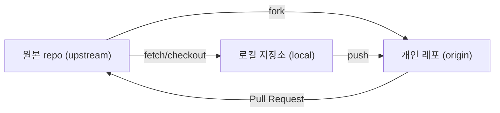

# 과제 제출 가이드 (Fork 방식)
이 repo.는 오픈소스SW프로젝트 수강생들이 실습하기 위한 원본(origin) repo.입니다.  
참여 수강생은 **Fork → 본인 학번 브랜치에서 작업 → Pull Request(PR)** 순서로 제출

---

## 제출 절차 (가이드)

1. **Fork**  
   - 이 원본 repo.를 자신의 GitHub 계정으로 fork

2. **Clone & Upstream 설정**  
   - fork한 레포를 로컬에 클론.  
   - 원본 레포를 `upstream`으로 등록

3. **학번 브랜치로 이동**  
   - `students/<학번>` 브랜치를 체크아웃
   - 예) 학번이 20231234 → `students/20231234`

4. **과제 작성**  
   - 본인 폴더(`submissions/<학번>/solution.py`)만 수정
     - 해당 파일에서 {} 칸에 이름 기입하고 커밋
   - 다른 경로나 파일은 변경하지 마세요!

5. **Push & Pull Request**  
   - 수정한 내용을 자신의 fork(origin)으로 push
   - GitHub에서 PR을 생성
     - **base: upstream/main**  
     - **compare: origin/students/<학번>**

---

## 협업 흐름도

